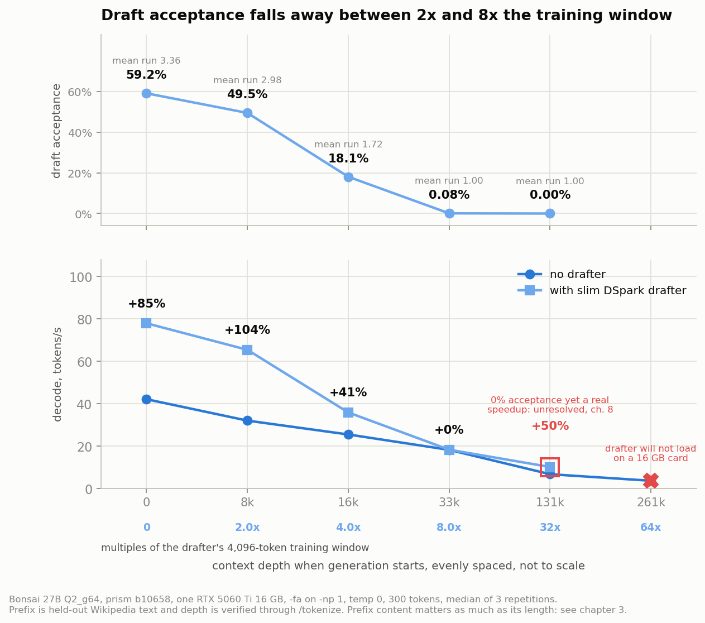
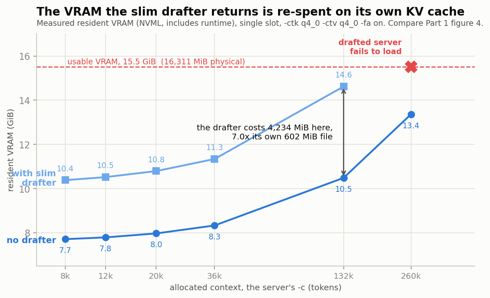
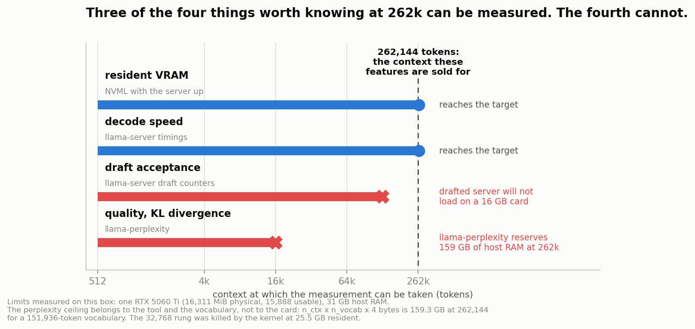

# Everything works at 512 tokens

**Long-context features on a 16 GB card, measured at the depth they are sold for.**

A continuation of [16 GB bench-in-a-box](https://github.com/Astezelex/bonsai-27b-16gb-bench),
which established independent quality anchors for PrismML Ternary Bonsai 27B against
Qwen3.6-27B UD-IQ2_XXS on one RTX 5060 Ti. That part argued for reporting **score@budget**
instead of score. This part re-runs those anchors on the rebased engine, then takes the three
long-context features that shipped since and measures each one at the context it exists for.

Everything here was produced at the maintainers' request, after they asked for a re-test on the
rebased `prism` branch and re-asked a question first put in July.

## Abstract

Three features shipped on this stack since Part 1, and all three are long-context features:
K-cache mean-centering, which is what makes a q4_0 K cache safe; the slim DSpark drafter, which
is presented as returning VRAM that becomes context; and the 262,144-token configuration those
two exist to enable. Each is published as a single number, and **every one of those numbers was
measured with an empty or nearly empty KV cache**.

Each reproduces exactly at the depth it was taken at, and each behaves differently at depth. The
drafter is worth +85.0% at depth 0, +104.2% at 8k, and **+0.4% at 33k**, because the drafter
itself carries `n_ctx_train = 4096`. Mean-centering is worth -24.6% at n_ctx 512 on an f16 V
cache, **-7.3%** in the symmetric cache pairing a 262k deployment must use, and **+0.7%** at
16,384. The VRAM the slim conversion returns is 1,257 MiB, and the drafter then spends
**2,647 MiB fixed plus 11.75 MiB per 1,000 tokens** on its own KV cache, so at 262k the drafted
server does not load on a 16 GB card at all.

The second contribution is structural, and it is why none of this had been measured.
`llama-perplexity` reserves `n_ctx x n_vocab x 4` bytes of host memory, **159.3 GB at 262,144
tokens**, so quality at the headline context is unmeasurable below roughly 160 GB of RAM.
`llama-bench` has a depth flag but no flag for the bias and none for a draft model. An ecosystem
publishing depth-0 scalars for long-context features is publishing the only numbers its
instruments return. The proposal is the same shape as Part 1's: report **metric@depth**, not
metric.

## The one methodological point

| feature | the published number | the same thing, measured at depth |
|---|---|---|
| DSpark speculative decoding | +73% to +93% decode | **+85.0%** at depth 0, **+104.2%** at 8,208, **+0.4%** at 32,918 |
| K-cache mean-centering | -24.6% mean KL divergence | **-24.6%** at n_ctx 512, **-0.7%** at 8,192, **+0.7%** at 16,384 |
| the drafter's returned VRAM | "basically free context" | costs **2,736 MiB** at 8k, **4,234 MiB** at 135k, **does not load** at 262k |








## Scorecard against the maintainers' summary

Seven claims held. Five did not. Every correction carries its command, its artefact and a
suggested fix.

| claim | verdict |
|---|---|
| The rebased release line works on sm_120 with no source build | **holds** |
| v7 reads `Q2_g64`; the old `Q2_0` is refused with a pointer | **holds** |
| `PQ2_0` is about 6% smaller | **holds**, 5.54%, and 3.8% faster at decode |
| Calibrate the bias with `-ctk q4_0` | **holds**, and the loader enforces it |
| Centering is validated together with speculative decoding | **holds**, costs under 0.3% and 2 MiB |
| The slim drafter is about 0.6 GB and gives +73% to +93% | **holds at depth 0**, +85.0%, and +104.2% at 8k |
| Mean-centering gives -24.6% mean KLD | **holds exactly**, in the configuration it was measured in |
| A mismatched bias is rejected at load with a clear message | **does not hold**, chapter 7 |
| The byte-identical-at-temp-0 property still holds by construction | **does not hold**, 2 of 5 |
| The 1.3 GB the slim drafter returns is basically free context | **does not hold**, chapter 4 |
| Native CUDA 13.3 builds are landing in the release matrix | **does not hold**, 12.4 and 12.8 only |
| The 4.5% fork-mainline skew is gone by construction | **halved, not gone**, 2.42%, chapter 7 |

## Chapters

| # | chapter |
|---|---|
| 1 | [The claim: report metric@depth, not metric](chapters/01-metric-at-depth.md) |
| 2 | [The instrument still reads true](chapters/02-instrument-reads-true.md) |
| 3 | [Speculative decoding is a 4,096-token feature](chapters/03-drafter-is-a-4k-feature.md) |
| 4 | [The returned VRAM is re-spent, not returned](chapters/04-vram-is-respent.md) |
| 5 | [Mean-centering is a short-context result](chapters/05-centering-is-short-context.md) |
| 6 | [Why nobody had measured this](chapters/06-the-tooling-ceiling.md) |
| 7 | [Engine parity, packaging, and one missing metadata key](chapters/07-parity-packaging-metadata.md) |
| 8 | [What did not resolve](chapters/08-what-did-not-resolve.md) |
| 9 | [The box, the rules, and how to redo any of it](chapters/09-reproduce-and-provenance.md) |

## Quickstart

```
# chapters 3 and 4: depth x centering x drafter, single card, about 100 minutes
CARD=1 FILLER=natural bash scripts/pasha_depth_sweep.sh

# chapter 5: the KLD ladder, aborts if its control rung fails to reproduce -24.6%
CARD=1 bash scripts/pasha_kld_ladder.sh

# any accuracy figure, with the cap rate it is meaningless without
python3 scripts/report_gate.py <evalscope-run-dir> <max_tokens>

# figures, from generated data only, no hardcoded numbers
python3 scripts/mk_part3_figdata.py > figures/figdata-part3.json
python3 scripts/make_figures_part3.py figures/figdata-part3.json figures/
```

The sweep prints its own ETA before it starts and refuses to run without a recorded
single-cell proof beside it. The ladder aborts unless its control rung reproduces Part 2's
published -24.6% within tolerance. Both refusals are deliberate: chapter 9 says why.

## What would help most from someone else

A card larger than 16 GB, so the drafter and a 262k context can be measured together at all. A
host with 64 GB or more, so the KLD ladder reaches past 16,384 tokens. And a bias recalibrated
at each rung, which needs no special hardware and would settle whether mean-centering is
short-context by nature or only by default.

License: MIT. Not affiliated with PrismML, Alibaba/Qwen, or any vendor.
