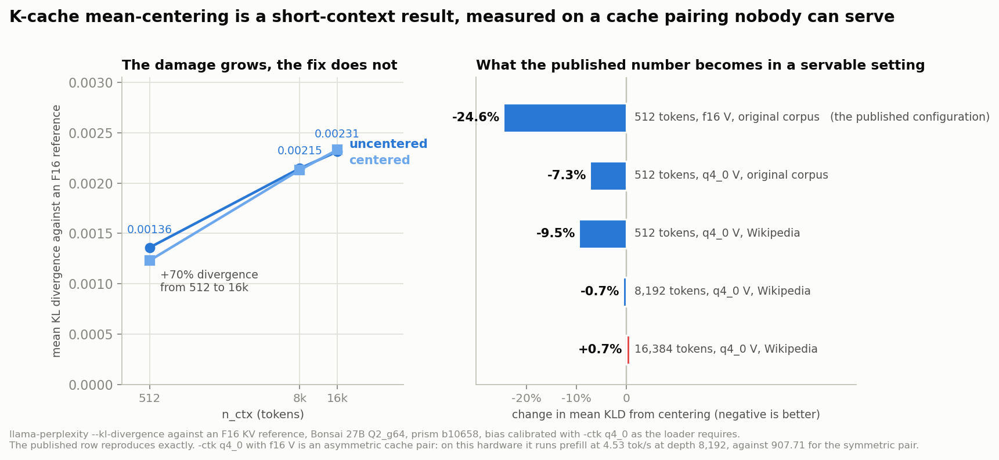

# 5. Mean-centering is a short-context result on a cache pairing nobody can serve

K-cache mean-centering is the feature that makes the whole 262k story possible. A q4_0 K cache
is what fits 262,144 tokens in 13.3 GiB, and centering is the correction that is supposed to
make that cache safe to use. Its published result is a **24.6% reduction in mean KL divergence
against an F16 reference for a 2 MiB bias file**, which is the best cost-to-benefit ratio
anywhere in this stack.

That number reproduces here exactly. Uncentered mean KLD 0.000646, centered 0.000487, a change
of -24.6%, on the first attempt, over the same held-out corpus at the same n_ctx.

Everything else in this chapter is about what happens to it on the way to a deployment.



## One variable at a time

The published measurement and a 262k deployment differ in two ways at once: the V cache and the
corpus. Changing both together would make any difference unattributable, so each was moved
alone, at n_ctx 512 where a rung is cheap.

| n_ctx | corpus | V cache | uncentered | centered | benefit |
|---|---|---|---|---|---|
| 512 | original | f16 | 0.000646 | 0.000487 | **-24.6%** |
| 512 | original | q4_0 | 0.001019 | 0.000945 | -7.3% |
| 512 | Wikipedia | q4_0 | 0.001360 | 0.001231 | -9.5% |
| 8,192 | Wikipedia | q4_0 | 0.002145 | 0.002130 | **-0.7%** |
| 16,384 | Wikipedia | q4_0 | 0.002312 | 0.002329 | **+0.7%** |

The corpus barely matters, -7.3% to -9.5%. The other two changes matter a great deal.

## The V cache is the larger of the two, and it is a trap in the documentation

The loader requires `--cache-type-k q4_0` when a centering bias is loaded, and it says so:

```
--kv-mean-center FNAME   path to a K-cache mean-centering bias file (GGUF) ...
                         requires --cache-type-k q4_0
```

Follow that instruction in `llama-perplexity` and set nothing else, and the V cache stays at
its default of f16. That is an **asymmetric cache pair**, and asymmetric pairs are a documented
slow path in llama.cpp: the fused Flash Attention kernels are specialised per cache type and a
mismatched pair falls back silently, with a related open issue reporting that asymmetric types
cannot be offloaded to GPU at all.

Measured on this hardware, same model, same card, K held at q4_0:

| V cache | prefill at depth 0 | prefill at depth 8,192 | decode at depth 8,192 |
|---|---|---|---|
| q4_0 | 1,020.10 tok/s | **907.71** | 32.99 |
| f16 | 241.04 | **4.53** | 2.56 |

A 200-fold prefill difference at 8k depth. Nobody serves a 262k context on the f16-V path;
the configuration would take hours to fill the cache once. So the -24.6% is a real measurement
of a configuration that cannot be deployed, and in the symmetric pairing that a 262k
deployment must use, the same bias on the same corpus at the same context is worth **-7.3%**.

This is not a criticism of the measurement. It is a criticism of the default. The documented
procedure sets one flag and inherits the other, and the inherited one is both slower and more
flattering. One extra character in the docs, `-ctv q4_0`, fixes it.

## The damage grows while the fix fades

The right half of the figure is the benefit. The left half is the part that matters more.

Absolute divergence introduced by a q4_0 K cache, held-out Wikipedia, symmetric q4_0 V:
**0.001360 at n_ctx 512, 0.002145 at 8,192, 0.002312 at 16,384**. That is a **70% increase in
divergence** across five doublings of context, and it rises monotonically.

So the two curves move in opposite directions. The error the feature exists to correct gets
worse as context grows, and the correction stops working over the same range: -9.5%, then
-0.7%, then +0.7%. By 16,384 tokens the centered and uncentered arms are indistinguishable,
and the sign has crossed.

Sixteen thousand tokens is 6.25% of the context this feature was built to enable.

## The bias itself was fitted at 512 tokens

One limitation belongs here and not buried in chapter 8, because it bears directly on the
paragraph above.

`llama-kv-mean-center` estimates the per-channel means it stores from calibration text run at a
chosen context. Its own usage line reads `[-c 512]` and its default is 512, and that is what
produced the bias used everywhere in this part. So every rung above n_ctx 512 in the table
applies **a bias fitted at 512 tokens to a context up to thirty-two times longer**.

That is the documented procedure, so the finding stands as written: a bias produced the way the
tool suggests loses its benefit by 8,192 tokens. What is not known is whether the decay is a
property of the correction or a property of the calibration. If the per-channel means drift
with sequence position, a bias fitted at 16,384 might hold at 16,384, and the feature would be
fine while its default is not.

Recalibrating at each rung and re-running the ladder is the single most valuable follow-up in
this part. It costs about two GPU-hours and it was not run.

One related concern can be dismissed with the data already in the table. The bias was
calibrated on the original self-generated corpus and three rungs evaluate on Wikipedia, so a
distribution mismatch is present. It is not hurting: at the same context and cache setting, the
cross-distribution rung scores **-9.5%** against the matched rung's **-7.3%**. The mismatch
made the benefit slightly larger, not smaller.

## What centering does cost, which is almost nothing

The speed half of the original question has a clean answer. Across six depths from 0 to
262,144, centering moves decode by between **-0.24% and +0.30%**, which straddles zero and is
measurement noise, and it costs **exactly 2 MiB of VRAM at every one of them**:

| depth | decode without | decode with | VRAM without | VRAM with |
|---|---|---|---|---|
| 0 | 42.11 | 42.10 | 7,893 MiB | 7,895 MiB |
| 8,192 | 32.02 | 31.95 | 7,975 | 7,977 |
| 32,768 | 18.25 | 18.22 | 8,527 | 8,529 |
| 131,072 | 6.78 | 6.79 | 10,735 | 10,737 |
| 262,144 | 3.69 | 3.70 | 13,679 | 13,681 |

A flat 2 MiB at every context, including the headline one. It also works with the drafter
attached, which the maintainers state and which holds here.

So the recommendation is not to turn the feature off. It costs nothing, it is correct at short
context, and there is no reason to disable something free. The recommendation is that
**-24.6% should not be quoted as its effect at 262k**, because the measurement that would
support such a claim has never been run by anyone. Chapter 6 explains why not.
